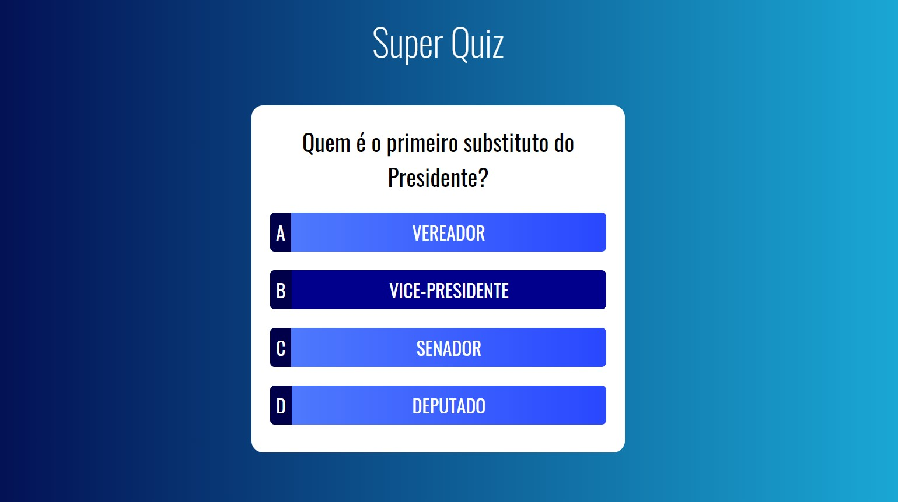

# Super Quiz

- **JavaScript developed by:** [Julio L. Muller](https://github.com/juliolmuller)
- **HTML & CSS delivered by:** [Cod3r](https://www.cod3r.com.br/)
- **Released on:** Apr 11, 2020
- **Updated on:** Apr 11, 2020
- **Latest version:** 1.0.0
- **License:** MIT

## Overview

Application developed to play Vue.js animations.

## Run Application

Take a look at this application running [here](https://juliolmuller.github.io/super-quiz/).

## Project setup

Run `npm install` to download all dependecnies and get the project set up.

## Development server

Run `npm run serve` for a dev server. Navigate to `http://localhost:8080/`. The app will automatically reload if you change any of the source files.

## Build

Run `npm run build` to build the project. The build artifacts will be stored in the `docs/` directory.
